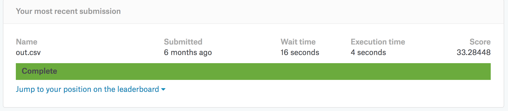

# CS 152
# Assignment 1
# September 13, 2018
##  Due September 19, 2018, 11 PM.

In this assignment, you’ll work with the Kaggle Dog Breed Identification dataset. Your model will distinguish between 120 different breeds of dogs. The end result of this assignment is to make a submission to Kaggle for this challenge.

Things you’ll need:

* A Kaggle account
* A Clouderizer account
* A Github account
* A machine with a GPU (personal, Colaboratory, Google Cloud Platform, or other)

Things you’ll need to do:

* Download the dataset
* Join a team on Github (follow the invitation link sent via email)
* Get a GPU machine running Jupyter Notebok.
* Clone your team repository.
* Do your work in the Python notebook assignment1.ipynb
* Import the dataset into the fastai library:
    * Approach 1: using Python and/or shell commands, create a directory structure similar to that in the dogs/cats example (except with 120 subdirectories rather than 2). Then, load the data using ```ImageClassifierData.fromPaths```. Or,
    * Approach 2: Use the given CSV file and load the data using ```ImageClassifierData.from_csv```.
      (You’ll probably find ```dataset.get_cv_idxs``` useful.)
* Train your model until you have a model that generalizes well.
* Use your model to classify the test images.
* Create a CSV file that contains the predictions for the test images.
* Submit the CSV file to Kaggle.
* Take a screenshot of the result of your submission, and add it to your notebook: 
* Commit your notebook and push it to GitHub.

## Submission details

Start your notebook with a list of your team members. Make sure that the notebook documents not only the code that has run (and make sure it is all of it, including any massing the input format of the data), but also documents what you are doing and why. Also, make sure your notebook shows the screenshot of your Kaggle submission. There is no specific score needed for your Kaggle submission, but I encourage you to obtain a good score. 

Commit your Jupyter notebook (```assignment1.ipynb```) to Git and push it to GitHub. You only need one submission per team, and the last commit on GitHub before the due date will be your submission.

